# Содержание

1. [Git Bash](#Git_Bash)
2. [Создание нового репозитория локально](#Создание_нового_репозитория_локально)
3. [Commit](#Commit)
4. [Github](#Github)

## Git Bash
* [Git Bash](https://git-scm.com/downloads)-это приложение, которое обеспечивает работу командной строки Git в операционной системе. Это оболочка командной строки для включения git с помощью командной строки в системе. Оболочка-это терминальное приложение, используемое для взаимодействия с операционной системой с помощью письменных команд.
## Создание нового репозитория локально
* Открываем Git Bash перед вами появляется вот такое вот окно:
  
  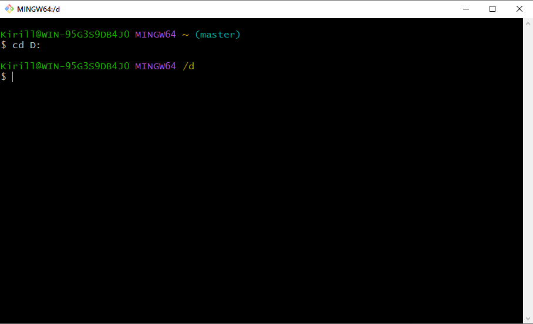
* Если у вас уже есть проект в каталоге, который не находится под версионным контролем Git, то для начала нужно перейти в него. Если вы не делали этого раньше, то для разных операционных систем это выглядит по-разному:

для Linux:
```shell
$ cd /home/user/my_project
```
для Windows:
```shell
$ cd C:/Users/user/my_project
```
* Если у вас нет проекта в каталоге, то создаем свою папку в удобном для вас месте и переходим в созданную нами директоию командой выше:
```shell
$ mkdir C:/Users/user/[имя проекта]
```
* а затем выполните команду:

```shell
$ git init
```
  Эта команда создаёт в текущем каталоге новый подкаталог с именем .git, содержащий все необходимые файлы репозитория — структуру Git репозитория. На этом этапе ваш проект ещё не находится под версионным контролем. Подробное описание файлов, содержащихся в только что созданном вами каталоге .git
  
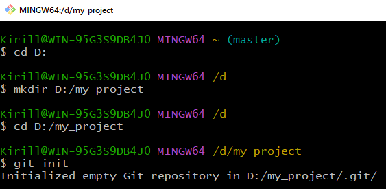

* Команда 
```shell
$ git status
``` 
отображает состояние рабочего каталога и раздела проиндексированных файлов. С ее помощью можно проверить индексацию изменений и увидеть файлы, которые не отслеживаются Git. Информация об истории коммитов проекта не отображается при выводе данных о состоянии. Для этого используется команда 
```shell
$ git log
```


Как мы видим на данный момент у нас нет коммитов на ветке матер и сам git предлогает создать файл и добавить его. Давайте сделаем это:
```shell
$ nano test.py
```
Напишем ростенькую программу, далее нажимам ctrl+O и для выхода ctrl+X:
```python
print("I'am Learn git")
```
* Далее нажимам ctrl+O и для выхода ctrl+X
* Проверим git status видим наш новый файл. Теперь добавим его с помощью команды:
```shell
$ git add test.py
```
* Или если у вас несколько файлов можно добавить их все одной командой:
```shell
$ git add --all
```
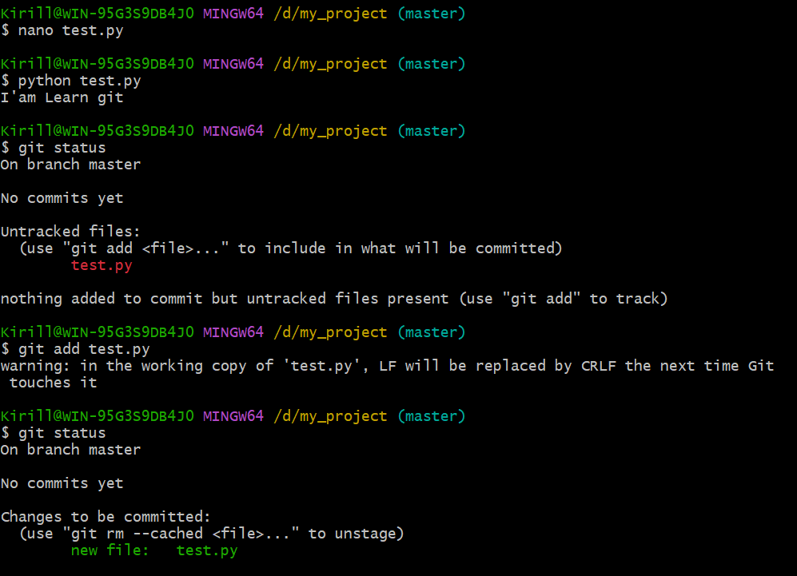
# Commit
- Коммит это одно из базовых понятий в Git. Если объяснять простым языком, то коммит это огромная копия вашего проекта в момент времени, когда этот коммит был сделан.
Но на самом деле git пытается быть лёгким и быстрым, так что он не просто слепо копирует весь проект каждый раз, а ужимает коммит в набор изменений или «дельту» между текущей версией и предыдущей. Это позволяет занимать меньше места.
Также Git хранит всю историю о том, когда какой коммит был сделан и кем.
* Индекс в Git — это специальная промежуточная область, в которой хранятся изменения файлов на пути от рабочей директории до репозитория. При выполнении коммита в него попадают только те изменения, которые были добавлены в индекс.
* 
**Файлы в репозитории могут находиться в 3 различных “областях”.**

1. HEAD
2. Индекс
3. Рабочий каталог
* Индекс в Git — это специальная промежуточная область, в которой хранятся изменения файлов на пути от рабочей директории до репозитория. При выполнении коммита в него попадают только те изменения, которые были добавлены в индекс.
* Рабочий Каталог это ваша папка с файлами
* HEAD - это просто ссылка на объект фиксации, т.е commit.

* Теперь сделаем наш первый коммит, выполнив команду:
```shell
$ git commit
```
* Тем самым мы сохраним содержимое области Индекс как неизменяемый снимок в области HEAD. Обязательно нужно описать суть внесенных вами изменений, для этого используется флаг -m:
```shell 
$ git commit -m "First commit"
```
* Все, коммит готов. И файл попал в область HEAD. HEAD будет родителем следующего созданного коммита. Как правило, самое простое считать HEAD снимком вашего последнего коммита.

* Сделаем изменения в файле и проверим статус:
```shell
# Делаем изменения и сохраняем
$ nano tets.py
# Проверям статус и видим что внесено изменение в наш файл
$ git log 
```
* Снова:
```shell
$ git add test.py
$ git commit -m "Change firts commit"
```
* На нашей ветке теперь два коммита
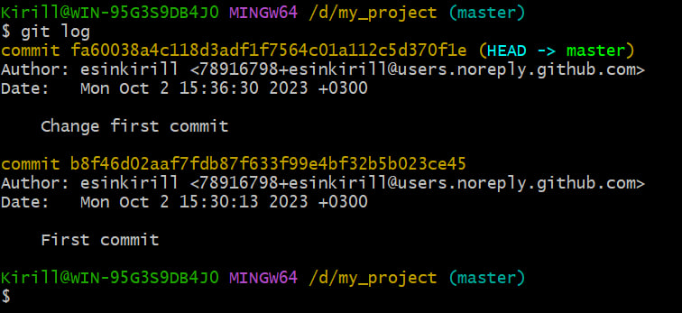
* Видим что HEAD указывает на последний commit и для того чтобы нам откатиться к более старой версии нашего репозитория используем команду checkout:
```shell
# можно выделить ссылку коммита на который хотим перейти нажать колесико мыши и вуаля выделенная область копируется в наше поле ввода:) 
$ git checkout b8f46d02aaf7fdb87f633f99e4bf32b5b023ce45
# Или же мы можем переместиться на один или несколько коммитов назад
$ git checkout^
$ git checkout~<num>
# Можем зайти в файл и увидим его версию до изменений  
$ nano test.py
# Вернуться назад
$ git checkout master
```
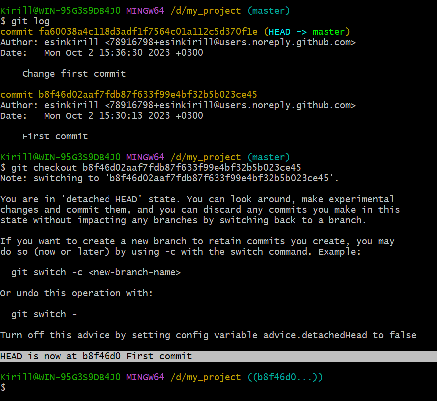

## Github
**Настройка доступа к GitHub через ssh ключ**
* SSH (Secure SHell) - это протокол, который позволяет безопасно авторизоваться в различные сервисы, подключаться к удаленным терминалам, передавать по шифрованным каналам информацию. Очень распрастранен при работе с репозиториями. Использует пару ключей - публичный и приватный.

* Открывайте GitBash или терминал, вводите:
```shell
$ ssh-keygen -t ed25519 -b 4096
```
Вам будут заданы несколько вопросов:

Куда сохранить файл (Enter file in which to save...) - нажмите Enter и по умолчанию ключ будет назван id_ed25519 и сохранится в .ssh папке профиля текущего пользователя. (в Windows папки пользователя в C:/Users, в macOs/Linux папка пользователя в /home)

Введите кодовую фразу (Enter passphrase...) - опционально, кодовая фраза это элемент безопасности. Если ваш приватный ключ попадет в чужие руки, им не смогут воспользоваться пока не подберут кодовую фразу. Это даст вам больше времени для замены ключей и отказа от скомпрометированного ключа. Предлагаю в данный момент отказаться от ключевой фразы и просто нажать Enter.

Подтвердить кодовую фразу или ее отсутсвие, тоже нажав Enter.

* Заходи в папку где сохранились ключи, тот что .pub открываем с помощью блакнота и копируем содрежимое.
* Заходим на [Github](https://github.com) регестрируемся.
* Далее заходим в настройки в разделе Access находим SSH and GPG keys
* Нажимаем New SSH key
* Называем его как удобно, в поле key вставляем скопированное ранее и нажимаем Add SSH key.
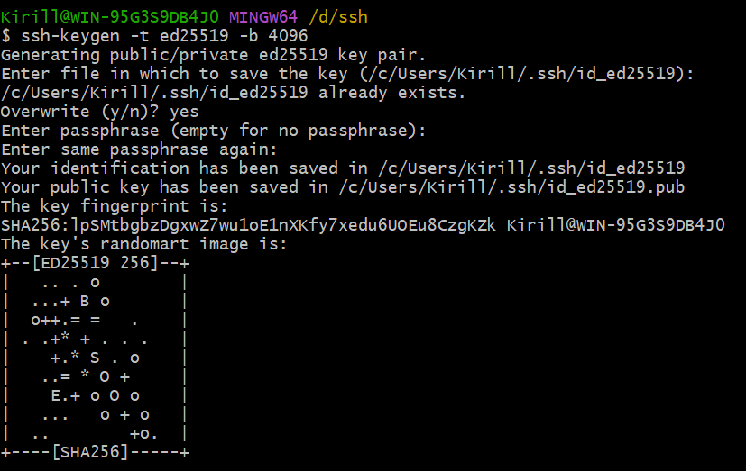

**Создать пустой репозиторий на GitHub**
* Заходим в Your repositories нажимаем New
* Вводим название
* Отсальные поля опционально
* Нажимаем Create repository
* Даллее будет такое окно:
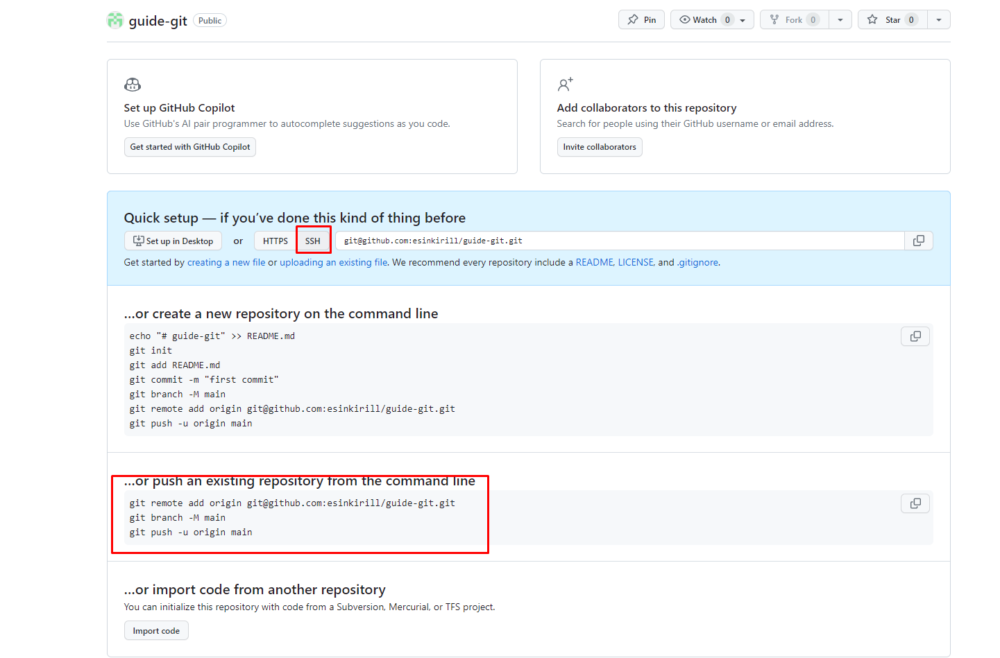
* Выбираем ssh
* Копируем три команды и вставляем их в Git Bash.
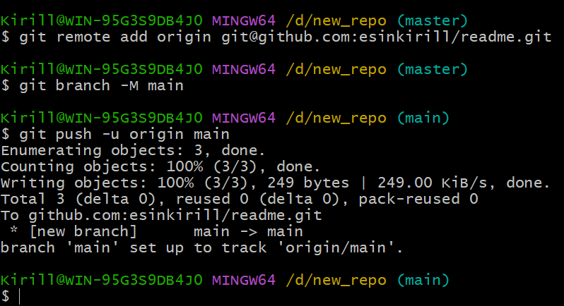
* Обновляем страницу и видим что наш файл успешно добавлен.
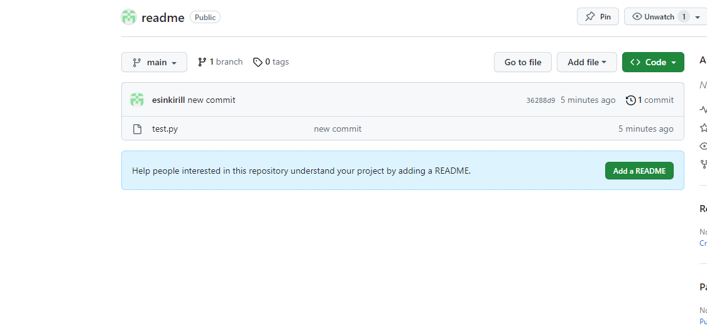

* Изменяем файл add commit и push, все по старой схеме только теперь это связано с github

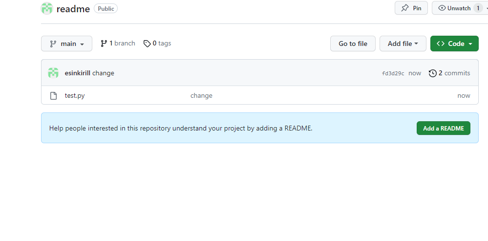

* Видим изменение на git

**Создание новой ветки**
* В консоли вводим команду:
```shell
$ git checkout -b [название ветки]
# Переходим на эту ветку
$ git checkout new_branch
# Создаем изменения в файле
$ nano test.py
$ git add test.py
$ git commit -m "issue_1"
$ git push
```
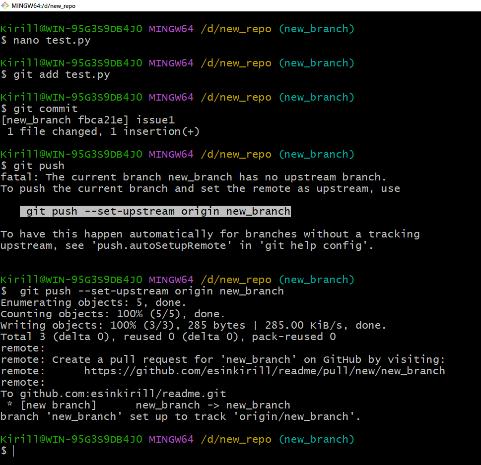

* Как видим сам git после команды push предлогает создать новую ветку на github
```shell
# Копируем и Enter
$ git push --set-upstream origin new_branch
```
* Заходим в нашу repo на сайте видим, что нам предлогаю создать pull_request

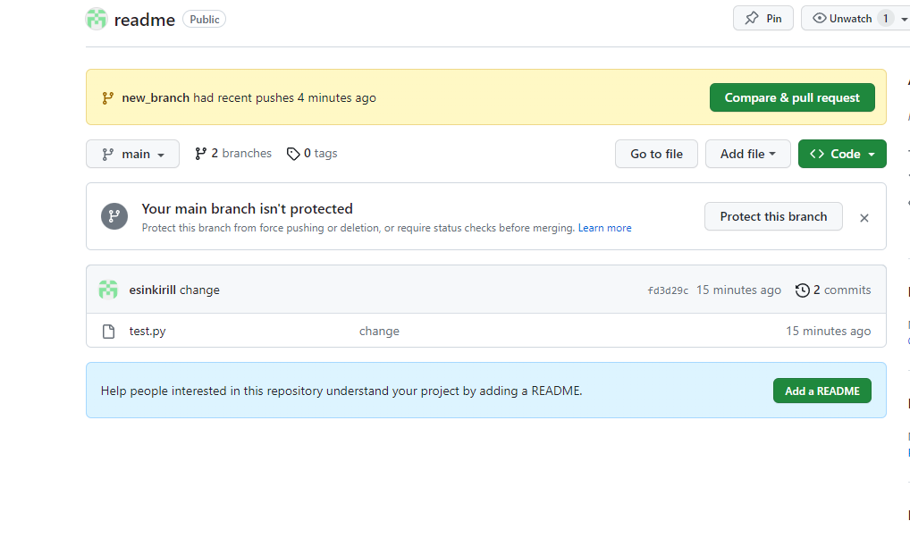

* Нажимаем Compare_and_pull_request, далее все опционально, но я предлогаю просто нажать Create_pull_request
* Заходим в настройки, Collaborators, Add people

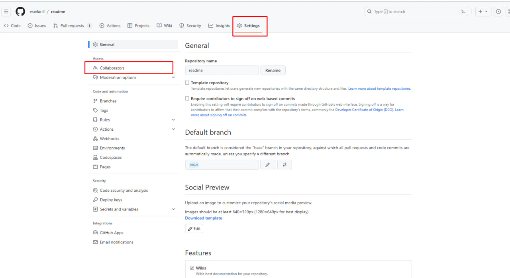

* Добавляем коллегу по нику и тд:


* Возвращаемся в pull_request и добавляем уже сюда нашего коллегу

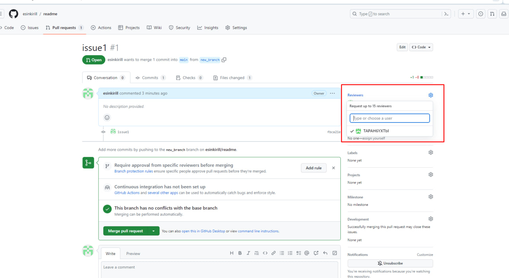

* Приглошаем его на code review через @
* Он комментирует код
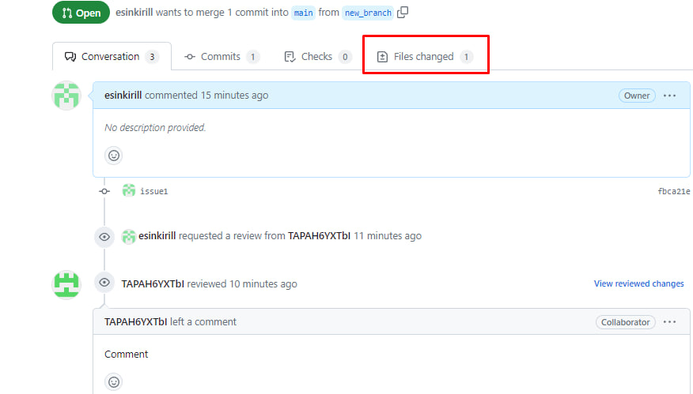


* Кокгда вы все обсудили соглосовали, то можно делать merge - используется в Git, чтобы собрать воедино разветвленную историю. Команда git merge выполняет слияние отдельных направлений разработки, созданных с помощью команды git branch, в единую ветку.
 
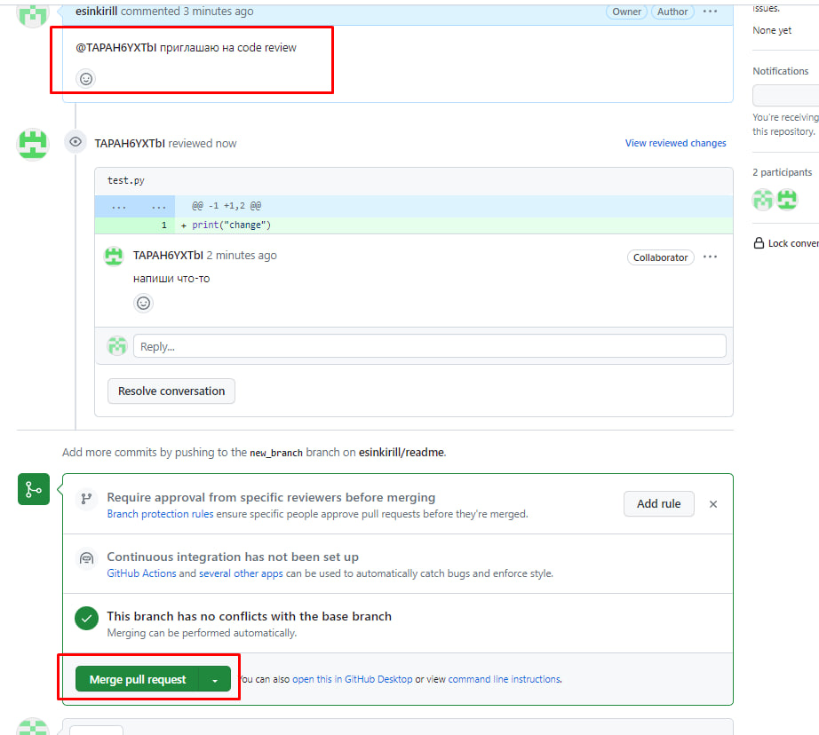

* Merge, confirm merge, delete branch.

**Это была вся основная информация по git**

**Спасибо за внимание**
 
