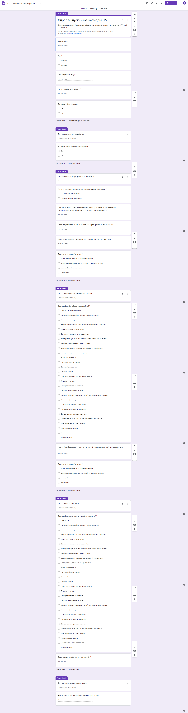

# Идея проекта
С помощью Google формы собираются данные выпускников (например, заработная плата) для дальнейшей обработки и визуализации. Таким образом, станет возможным отслеживание динамики собираемой информации, которая, в том числе, может быть интересна абитуриентам.
# Проделанная работа
## Google форма
Была создана [Google форма](https://forms.gle/SmqTzt3AAEfYREtQ6) с вопросами для выпускников (может быть восстановлена и отредактирована). Ниже приведены 6 структурных блоков этого опроса.

Структура вопроса про компанию, в которой работал/работает опрашиваемый, может быть изменена (не обязательно давать ссылку на список компаний, однако после потребуется вручную привести названия одних и тех же компаний к одному виду).

Данные опроса хранятся в Google таблице (можно настроить в редакторе Google формы).

## Связь Google таблицы и Python
[Здесь](https://www.geeksforgeeks.org/how-to-add-code-on-github-repository/) ресурс, который использовался для реализации данной идеи. В конечном итоге имеем excel файл с данными опроса, с которыми можно работать.

Каждый запуск кода сопровождается авторизацией в аккаунт Google и нажатием нескольких кнопок, это можно (нужно) изменить.
## Работа с таблицей данных
Для работы с таблицей была выбрана библиотека __pandas__. С её же помощью предполагается обработка невалидных данных, которые не будут учитываться в конечной статистике и не будут визуализированы.

В исходном коде обработку и визуализацию данных следует воспринимать как тестовую попытку, развивать проект стоит по вышеописанному пути.
